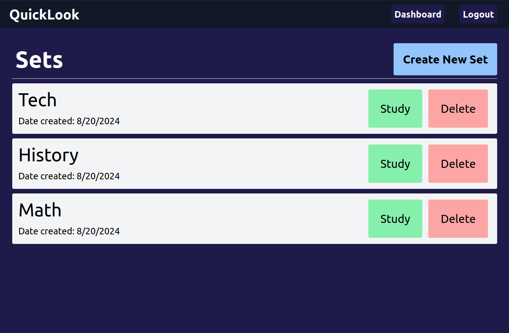
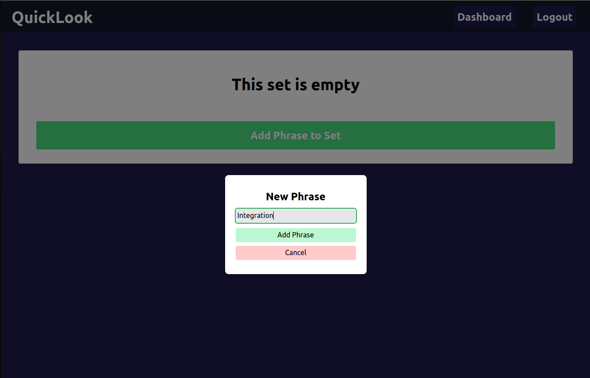
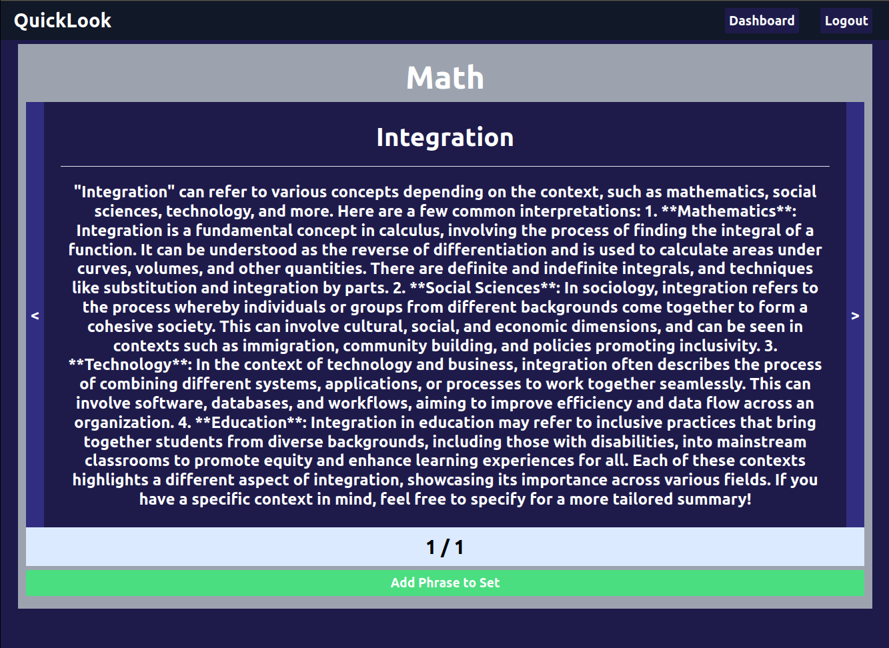
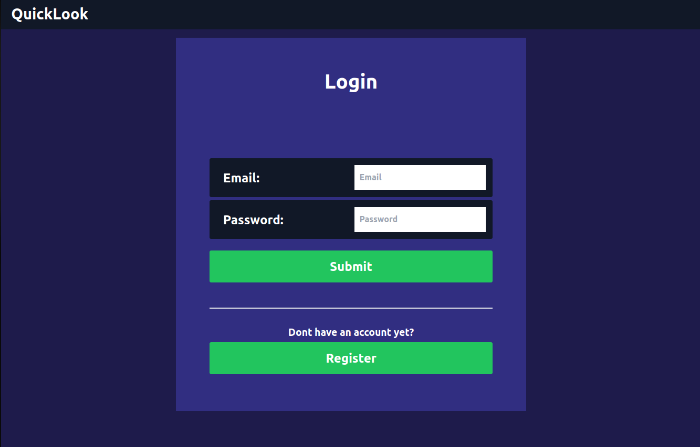
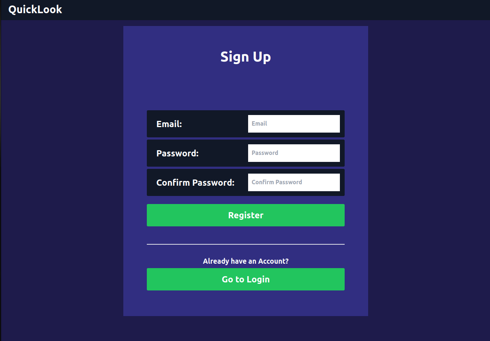

# QuickLook Frontend
This is a [Next.js](https://nextjs.org/) project bootstrapped with [`create-next-app`](https://github.com/vercel/next.js/tree/canary/packages/create-next-app) that uses the [OpenAI API](https://platform.openai.com/) to generate a short summary about a phrase or term that users would like to learn more about. Users can organize phrases they would like to learn about by organizing them into study sets. Make sure to check out the [QuickLook Backend](https://github.com/Kevin-Aguirre/QuickLook-Backend).

## Getting Started

You can simply clone this repository and run the development server:

```bash
npm run dev
# or
yarn dev
# or
pnpm dev
# or
bun dev
```


## Snapshots

### Dashboard



### Empty Set



### Study




### Login / Register




## Technologies Used 
- React.js
- Next.js
- JavaScript
- TypeScript
- Tailwind CSS
